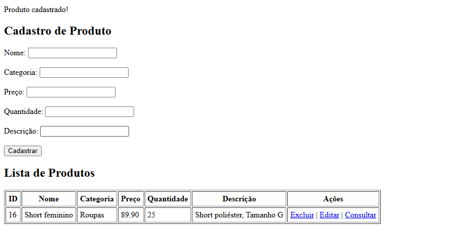
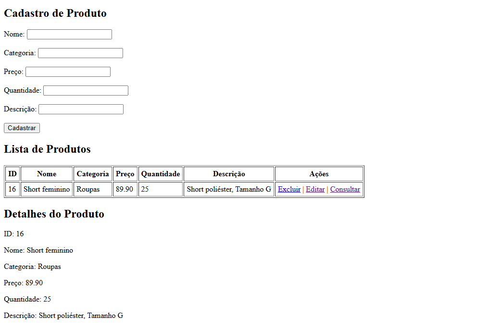

Sistema de Cadastro e Gerenciamento de Produtos (PHP + MySQL)

Este projeto é um sistema simples para cadastro, listagem, edição, consulta e exclusão de produtos, desenvolvido em PHP utilizando PDO e banco de dados MySQL.

🚀 Funcionalidades

✔ Cadastrar produtos

✔ Editar produtos existentes

✔ Excluir produtos

✔ Consultar detalhes de um produto específico

✔ Listar todos os produtos cadastrados

✔ Conexão com o banco usando PDO

📁 Estrutura do Projeto

O projeto consiste em um único arquivo PHP contendo:

Conexão com o banco

Processamento de requisições (GET e POST)

Formulário para cadastro/edição

Tabela de listagem

Exibição detalhada de produtos

Links de ação (editar, consultar e excluir)

🗄️ Arquivo PHP

 [Clique aqui para ver o código PHP](index.php)

🗄️ Banco de Dados

Crie um banco chamado loja_recuperacao e execute o SQL abaixo:

```sql
CREATE TABLE produtos (
    id_produto INT AUTO_INCREMENT PRIMARY KEY,
    nome VARCHAR(100) NOT NULL,
    categoria VARCHAR(100) NOT NULL,
    preco DECIMAL(10,2) NOT NULL,
    quantidade INT NOT NULL,
    descricao VARCHAR(255)
);
```

⚙️ Configuração

Clone o repositório:

git clone https://github.com/seuusuario/seurepositorio.git


Coloque os arquivos em uma pasta acessível pelo servidor local (ex: htdocs ou www).

Ajuste os dados de conexão, se necessário:

$pdo = new PDO("mysql:host=localhost;dbname=loja_recuperacao", "root", "");


Acesse pelo navegador:

http://localhost/sua-pasta/

🖼️ Modelo DER (Diagrama Entidade-Relacionamento)


🖼️ Imagens do Sistema





